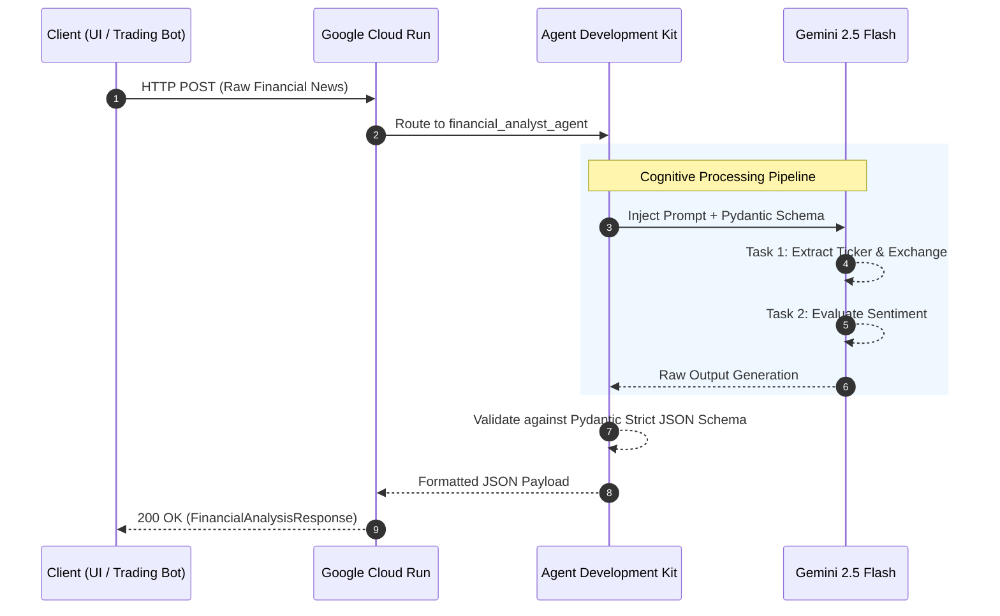
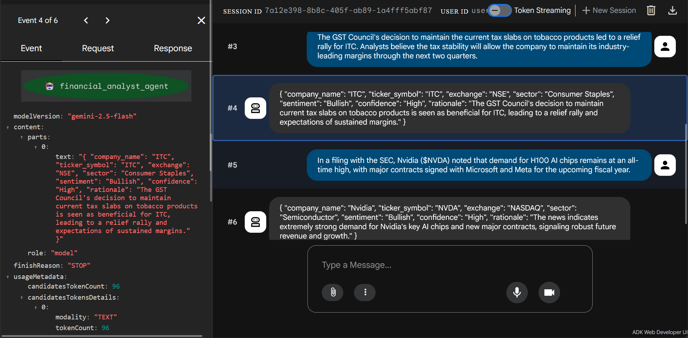
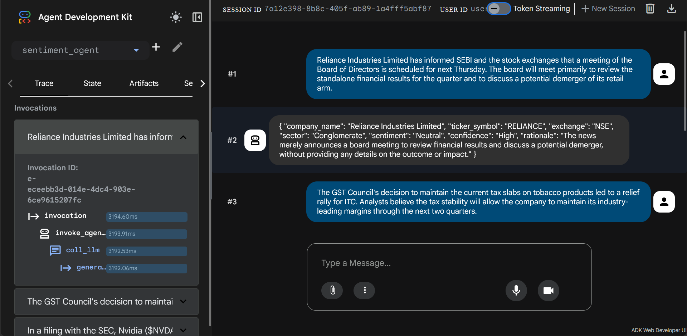

# 📈 Financial Stock Analyst AI Microservice

A serverless, AI-driven financial news classification agent built with the Google Agent Development Kit (ADK) and Gemini 2.5 Flash. 

This project was developed to demonstrate a production-ready, deterministic AI microservice deployed on Google Cloud Run.

## 🧠 Architecture & Core Capabilities

This agent operates as a strict **Unified Financial Analyst Microservice**. It performs a dual-step cognitive task within a single API call:

1. **Contextual Extraction:** Reads raw financial news and extracts the target Company Name, Market Sector, and Stock Ticker. It uses geographic and regulatory context clues (e.g., RBI, SEC, INR, USD) to accurately resolve "Ticker Collisions" and identify the correct trading exchange (NSE, BSE, NASDAQ, NYSE).
2. **Sentiment Analysis:** Evaluates the text to categorize market sentiment (`Bullish`, `Bearish`, or `Neutral`) and provides a strict one-sentence rationale.

**Tech Stack:**
* **Framework:** Google Agent Development Kit (ADK)
* **Model:** Gemini 2.5 Flash (via Vertex AI)
* **Data Enforcement:** Pydantic (Strict JSON Schema)
* **Hosting:** Google Cloud Run (Serverless Container)

## 📁 Repository Structure

```text
sentiment-agent/
├── agent.py            # Core AI logic, prompt instructions, and Pydantic schema
├── requirements.txt    # Python dependencies (google-adk, pydantic)
├── .env                # GCP routing configurations
└── __init__.py         # Module marker
```

## 🚀 Deployment to Google Cloud Run

This agent is packaged and deployed as a serverless container to Google Cloud Run. 

To deploy this agent with an interactive web interface for easy testing, the following ADK CLI command is used:

```bash
adk deploy cloud_run \
  --project=PROJECT_ID \
  --region=europe-west1 \
  --service_name=sentiment-ticker-ui \
  --with_ui \
  . \
  -- \
  --service-account=SERVICE_ACCOUNT \
  --allow-unauthenticated
```

## ⚙️ System Architecture & Logic Flow
The following sequence diagram illustrates how the ADK handles a request, performs dual-task inference via Gemini 2.5 Flash, and enforces the Pydantic JSON contract before returning the payload.


## 🧪 Testing the Endpoint

### Option 1: Web Interface
Because this agent was deployed using the `--with_ui` flag, you can interact with it directly via the browser.
1. Navigate to the provided Cloud Run URL.
2. Select `financial_analyst_agent` from the dropdown.
3. Paste a financial news snippet (examples below) into the chat.
4. The agent will return a strictly formatted JSON object.

### Option 2: Local Development (CLI)
To run this agent locally:
```bash
# Install dependencies
uv pip install -r requirements.txt

# Start the local ADK server
adk web
```

## 📊 Example Test Cases

**Test Case 1: Indian Market (Neutral)**
> *"Reliance Industries Limited has informed SEBI and the stock exchanges that a meeting of the Board of Directors is scheduled for next Thursday. The board will meet primarily to review the standalone financial results for the quarter and to discuss a potential demerger of its retail arm"*

**Test Case 2: US Market (Bullish)**
> *"Nvidia ($NVDA) surged 5% in after-hours trading following a massive beat on Q4 revenue. In a filing with the SEC, the company noted that demand for AI chips remains at an all-time high."*

**Test Case 3: Indian Market (Bullish)**
> *"The GST Council's decision to maintain the current tax slabs on tobacco products led to a relief rally for ITC. Analysts believe the tax stability will allow the company to maintain its industry-leading margins through the next two quarters."*

**Example JSON Output (Test Case 1):**
```json
{
  "company_name": "Reliance Industries Limited",
  "ticker_symbol": "RELIANCE",
  "exchange": "NSE",
  "sector": "Conglomerate",
  "sentiment": "Neutral",
  "confidence": "High",
  "rationale": "The news merely announces a board meeting to review financial results and discuss a potential demerger, without providing any details on the outcome or impact."
}
```

## 📸 Project Showcase
To prevent unauthorized quota usage, the live endpoint is not publicly linked. Below is visual proof of the deployed architecture and successful inference.</br>
*The agent successfully resolved an Indian market "Ticker Collision" via the ADK UI.*

